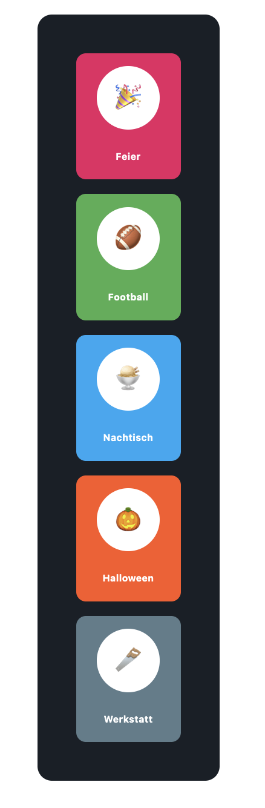
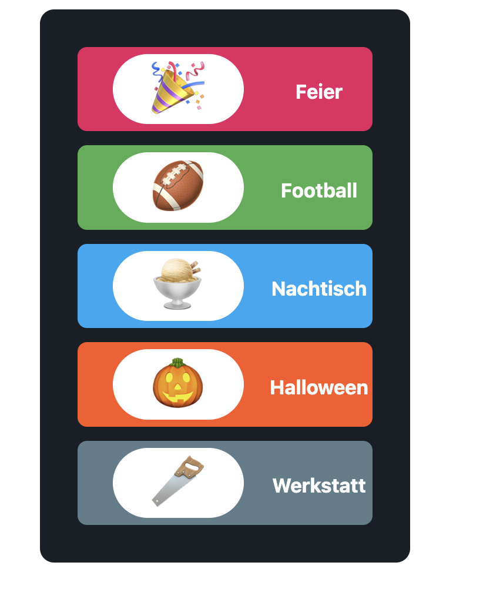

# Feedback on Task

This is a short document detailing my thoughts and experiences on the task.

## Work Done + Comments
**Time Taken:** approx. 2 hours

### Task 1
- I created a seperate EventCard component and generated the cards somewhat dynamically.
- I added a circle around the icon and had them both resize responsively, along with the title text
- The circle shows up as more of a rounded rectangle on certain screen sizes, which I kept due to time constraints and because I thought it looked somewhat better, but I understand if that was not the requirement.
- I added dynamic background colour to the EventCard component
- I changed the font style of the title.
- The size of the icons on much larger screens could be improved.
- I tried to use functions and hooks where I could see fit, so that the code's logic can be readable and certain values stay in one place (and we do not have to change them in multiple placed). I would love to hear feedback on where I could have done better.

### Task 2
- I didn't spend too much time on this task, but on a wide enough screen, the flexDirection changes, which was my intention. I tried to keep the parts of the card as is and only change the flexDirection and proportions when a function indicated a change in size.

## Screenshots

